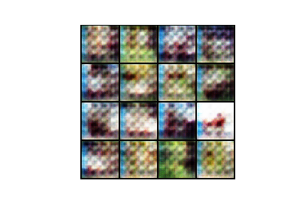

# sagan_pytorch
Self-Attention Generative Adversarial Networks implementation using this paper: https://arxiv.org/abs/1805.08318v1

Я провел небольшое исследование SAGAN в действии и сравнил эту архитектуру с популярной DCGAN.

Принцип работы SAGAN:

Используются 3 основных компонента:

	1. GAN
	2. Self-Attention
	3. Spectral Norm

## GAN
GAN’ы впервые были предложены в статье [[1, Generative Adversarial Nets, Goodfellow et al, 2014]](https://arxiv.org/abs/1406.2661) и сейчас очень активно исследуются.

GAN’ы состоят из 2 нейронных сетей:
1-ая — генератор сэмплит случайные числа из какого-то заданного распределения $P(Z)$, например $N(0,I)$ и генерируют из них объекты $X_p = G(Z; \theta_g)$, которые идут на вход второй сети,
2-ая — дескриминатор получает на вход объекты из выборки $X_s$ и созданные генератором $X_p$, и учится предсказывать вероятность того, что конкретный объект реальный, выдавая скаляр $D(X; \theta_d)$.

При этом генератор тренируется создавать объекты, который дискриминатор не отличит от реальных.

## Self-Attention
Про механизм Attention было известно давно, но в статье 2016 года [Attention Is All You Need](https://arxiv.org/abs/1706.03762) изменена концепция того, как можно работать с текстом по принципу Encoder-Decoder без рекуррентных ячеек. 

Часто применяется в машинном переводе и в целом для seq-seq задач текста.

## Spectral Norm
GAN'ы очень нестабильно обучаются, и поэтому совсем недавно был предложен вариант нормализации весов таким образом, чтобы генерировать изображения такого же качества с меньшим количеством параметров. [Публикация](https://arxiv.org/abs/1802.05957)

Достигается это путем накладывания ограничений на градиент функции дескриминатора путем вычисления l2-нормы и последующего хитрого преобразования.

В итоге, скомбинировав 3 этих компонента и получилась данная публикация.

Для простоты сравнения модель обучалась 5 эпох на датасете CIFAR10 сначала с архитектурой DCGAN, а потом после некоторых изменений с пом. SAGAN.

DCGAN             |  SAGAN
:-------------------------:|:-------------------------:
  |  
  |  
  |  
  |  
  |  
  |  

Видно, что сети изначально очень по-разному обучались. Простая свертка размывала окрестности, если еще не успевала обучиться, когда как свертка с attention-слоями сразу заполняла картинку похожей структурой и в целом могла изменять любую область изображения.

Результаты в целом получились схожие, но SAGAN обучался немного быстрее и итоговая модель весит в 3.4 раза меньше! (28 МБ против 95 МБ) 

Можно было поставить обучаться значительно дольше, но в силу нехватки времени и ресурсов я ограничился этим результатом.

